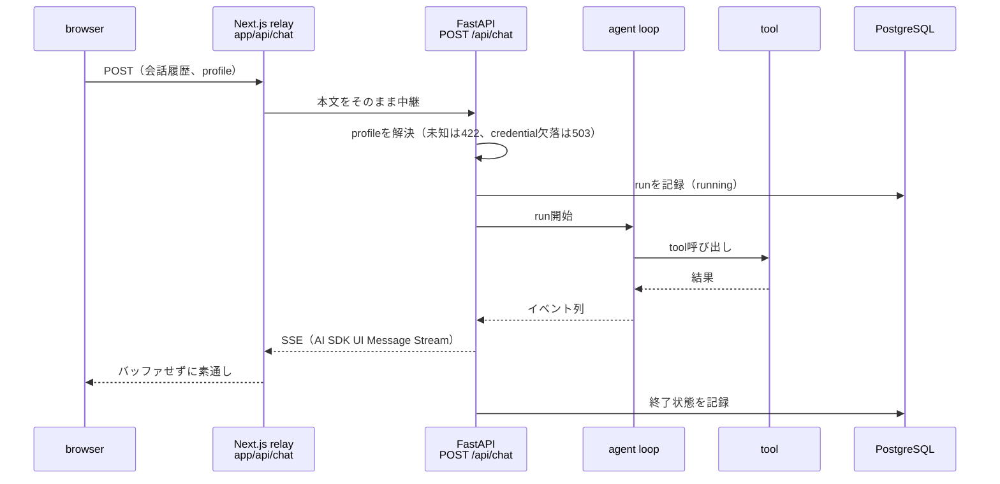

# アーキテクチャ

この文書は、backendとwebの層の分け方、依存の向き、1 turnの処理の流れ、HITLと永続化の扱いを決めます。
コードを追加する場所や、サンプルを自分のエージェントへ置き換える範囲を判断するときに読みます。
使っている技術と選定理由は[技術スタック](tech-stack.md)を参照してください。

## 層構成

### backend（`apps/api/`）

| directory | 持つもの |
|---|---|
| `agent/` | 用途に依存しないchatの仕組み。chat router、agent定義の型、tool登録、runtime、model生成、run記録、eval基盤 |
| `core/` | 設定、env loader、LLM profile registry、エラー契約、ログ、security header |
| `db/` | ORMのbase |
| `sample/` | サンプルのエージェント。agent、tool、fake model、同梱文書、eval suite |

`apps/api/application.py`がサンプルのagent定義とruntimeを共通のchat routerとlifespanへ渡してFastAPIを
組み立て、`apps/api/main.py`が起動入口になります。

### web（`apps/web/src/`）

| directory | 持つもの |
|---|---|
| `app/` | Next.jsのroute。画面のrouteはサンプルの画面を再exportするだけで、`app/api/chat/`はFastAPIへの中継を持つ |
| `components/chat/` | 用途に依存しないchatの画面部品と、送信・停止・承認応答・profile選択のhook |
| `components/ui/`、`components/ai-elements/` | shadcn/uiとAI Elementsの生成コード |
| `lib/` | 中継の規則、profile選択の規則、logger |
| `sample/` | サンプルの画面と、応答の描き方 |

## 依存の向き

- 依存は`sample/`から共通部分への一方向にします。backendの共通部分で`apps/api/sample/`をimportして
  よいのは`apps/api/application.py`だけです。検査は`apps/api/tests/test_runtime_dependency_direction.py`が
  行います
- 製品コード（`apps/`）は運用script（`scripts/`）をimportしません。同じtestが検査します
- webの`app/`の画面routeは`sample/`を再exportするだけにし、共通部品（`components/chat/`、`lib/`）は
  `sample/`をimportしません

エージェントを差し替えるときは、`sample/`を置き換え、`apps/api/application.py`とwebの画面routeの
参照先を書き換えます。共通部分は変えずに済む構成を保ちます。

## 1 turnの流れ

- browserはFastAPIを直接呼ばず、Next.jsのRoute Handlerを経由します。Compose内のservice名はbrowserから
  解決できないこと、認証を足すときの差し込み口をweb側に置くことが理由です。中継の規則は
  `apps/web/src/lib/chat-relay.ts`が持ちます
- FastAPIは、クライアントが送った会話履歴でagentを動かします。保存した履歴から会話を復元する経路は
  持ちません。持つ場合は認証と合わせて設計します
- profileはrequestごとに解決し、共有の設定は書き換えません。provider credentialはbrowserへ出しません。
  選択の規則は[LLM provider](#llm-provider)を参照してください

## HITL

書き込みを伴うtoolは、`apps/api/agent/approval.py`の`agent_tool`で`mutates=True`として登録します。
登録したtoolは実行前に承認を要求します。

1. agentが書き込みtoolを呼ぶと、runはtoolを実行せずに止まり、承認要求をSSEで返します。runの状態は
   `awaiting_approval`になります
2. 画面が承認または却下を表示し、利用者の応答を会話履歴に加えて自動で再送します
3. FastAPIは再送を新しいrunとして記録します。承認されたtoolは実行し、却下されたtoolは却下をtoolの結果として
   agentへ返して、続きを生成します

### 承認待ちのあいだの送信

最後のmessageが承認待ちのtoolを持つassistant messageのあいだ、画面は送信を止めます。

- 送信ボタンは押せず、Enterでも送りません。入力欄には打てて、打った文は残ります
- 理由は固定文言「承認か却下を選んでください。」で入力欄の上に出します
- 承認・却下のボタンは、その最後のmessageの承認待ちのtoolにだけ出します。それより前のmessageに残った
  承認待ちには出しません
- 承認または却下で再開のrunが終わると、送信できる状態に戻ります

backendはこの停止に関与しません。判定の正本は`apps/web/src/components/chat/tool-approval.tsx`の
`findPendingApprovalMessageId`です。

### 承認待ちのあいだの再読み込み

承認待ちのあいだに画面を再読み込みすると、会話は画面から消えます。クライアントは会話を保存しません。
サーバーは会話とrunを記録しますが、記録から会話を画面へ戻す経路はありません。

- 承認待ちだった書き込みtoolは実行されません
- runの記録は`awaiting_approval`のまま残ります
- 放棄された承認待ちと、応答を待っている承認待ちは、記録の上で区別しません

### 承認後の再送のprofile

承認後の再送は、承認を求めたrunと同じprofileで送ります。通常の送信と再試行は、画面で選択中のprofileを
使います。規則の正本は`apps/web/src/lib/chat-profiles.ts`の`resolveRequestProfile`です。

## 永続化

会話は`conversations`、agentの1回の実行は`runs`に保存します。スキーマの正本は
`apps/api/agent/models.py`、変更はAlembicのmigrationで行います。

| runの状態 | 意味 |
|---|---|
| `running` | 実行中。終了時刻が無いまま残ったものは、切断または異常終了を表す |
| `completed` | 最後まで生成した |
| `awaiting_approval` | 書き込みtoolの承認待ちで止まった |
| `cancelled` | アプリケーションのコード（toolなど）がrunを取り消した |
| `failed` | 実行中に例外が起きた |

runの記録を書けないときは応答を流さず、503を返します。ブラウザの切断は記録の更新を行わず、runは
`running`のまま残ります。

## 設定とlifecycle

- 設定は`apps/api/core/config.py`の読み手別getter（API、会話DB、LLM）から取得します。env fileを読むのは
  getterを最初に呼んだときだけで、requestの処理中にfileを読み直しません
- どのenv fileを読むかは実行context（`DB_ENV_CONTEXT`）が決めます。loaderは
  `apps/api/core/environment.py`です
- model client、会話DBの接続、用途固有のresourceは`AgentRuntime`（`apps/api/agent/runtime.py`）が
  所有します。startupで起動順に作り、shutdownで逆順に閉じます。起動の途中で失敗したときは、
  作り終えたものを閉じてから起動を失敗させます
- 同じ`AgentRuntime`を、API process、evalのtrial、実LLMテストが共有します

## LLM provider

使えるmodelと接続先は`apps/api/core/llm_profiles.py`のprofile registryが一組で決めます。起動時の既定
profileは`LLM_PROFILE`、画面の選択肢は`GET /api/chat/profiles`が返します。一覧は表示名と利用可否だけを
返し、credentialや接続先は返しません。profileの追加は[LLM providerとprofileの追加](howto/add-llm-provider.md)を
参照してください。

## サンプルと共通部分の境界

| 置き換えるもの（`sample/`） | 残すもの（共通部分） |
|---|---|
| agentのinstructionとtool | chat router、SSE、run記録 |
| toolの予算（1 turnのtool数、request数） | HITLの停止と再開 |
| fake modelの応答 | profile registryとprofile選択 |
| 画面の見出しと応答の描き方 | 中継、chatの画面部品 |
| eval suite（dataset、scorer、baseline） | eval基盤（runner、採点、証跡） |
